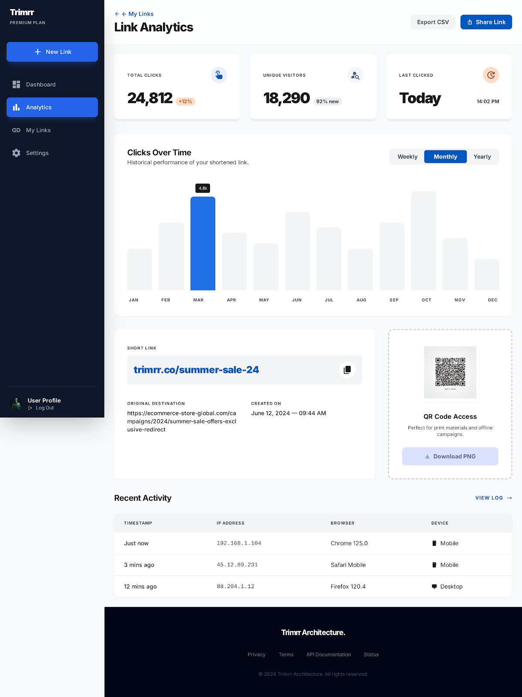

# Trimrr: Precision URL Shortener SaaS

Trimrr is a premium, high-performance URL shortening platform designed with a **"Liquid Smooth"** editorial aesthetic. Built for scalability and security, it offers real-time analytics, dynamic QR code generation, and integrated subscription management via Razorpay.


## 🚀 Key Features

- **Liquid Smooth UI**: A high-fidelity, "no-line" design built with Tailwind CSS and HTMX for a seamless, SPA-like experience.
- **Precision Analytics**: Real-time click tracking, device/browser detection, and 7-day visualization charts.
- **Dynamic QR Codes**: Generate high-precision QR codes with instant "Copy to Clipboard" functionality for physical marketing assets.
- **Secure by Design**: Built-in protection against redirect loops, malicious keywords, and malware-prone file extensions.
- **Enterprise-Ready Backend**: Automated Redis caching with graceful fallback logic, Celery-powered background tasks, and high-performance DB indexing.
- **Monetization Built-in**: Integrated Razorpay subscription gateway (Pro Tier at ₹399/year) with automated email welcoming.

## 📊 Dashboard & Analytics

Manage your links with precision. Track every click, visitor, and conversion in real-time.




## 🛠️ Technology Stack

- **Backend**: Python 3.x, Django 5.x
- **Frontend**: Tailwind CSS, HTMX, Alpine.js (via manual script)
- **Database**: PostgreSQL (Production) / SQLite (Local)
- **Caching**: Redis (with LocMem fallback)
- **Async Tasks**: Celery
- **Payments**: Razorpay API
- **Emails**: SMTP (Gmail)

## 📦 Setup & Installation

1. **Clone the repository**:
   ```bash
   git clone https://github.com/PranayaKD/trimrr.git
   cd trimrr
   ```

2. **Configure Environment**:
   Create a `.env` file in the root directory (referencing `.env.example` if available) with your DB, Redis, Razorpay, and SMTP keys.

3. **Install Dependencies**:
   ```bash
   pip install -r requirements.txt
   ```

4. **Run Migrations**:
   ```bash
   python manage.py migrate
   ```

5. **Start Dev Server**:
   ```bash
   python manage.py runserver
   ```

## 🔒 Security & Scaling

Trimrr is built to handle 1,000+ concurrent users using a **Cache-Aside** architecture. It prioritizes the "Redirect path" to ensure link resolution happens in milliseconds, even under heavy load, while analytics are logged asynchronously via background workers.

---

© 2026 Trimrr Editorial. Crafted for Precision.
